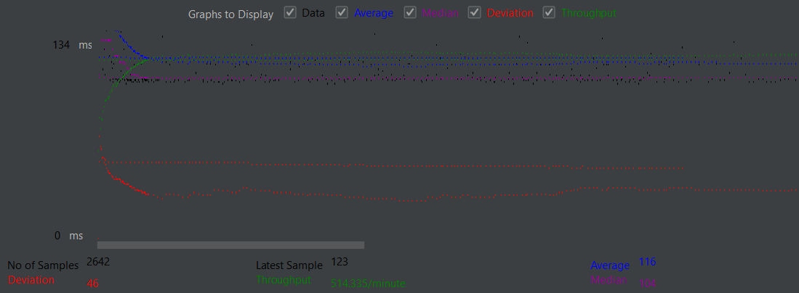
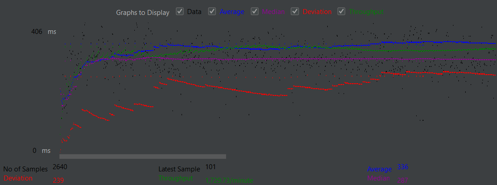
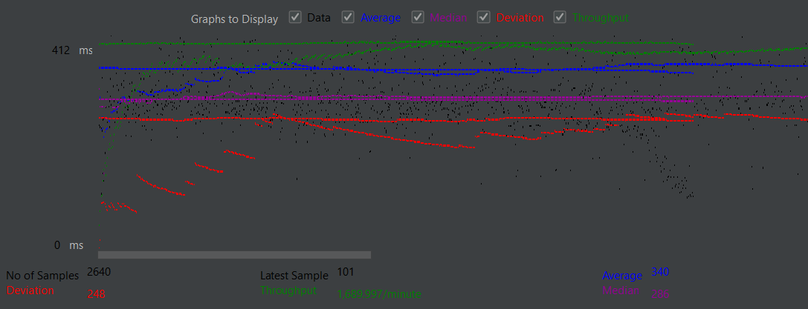
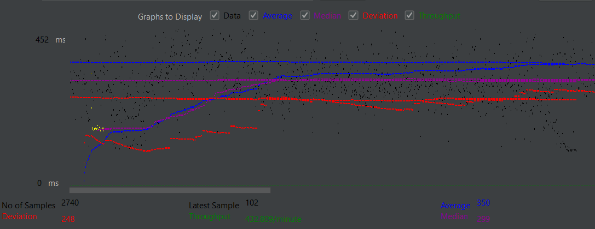
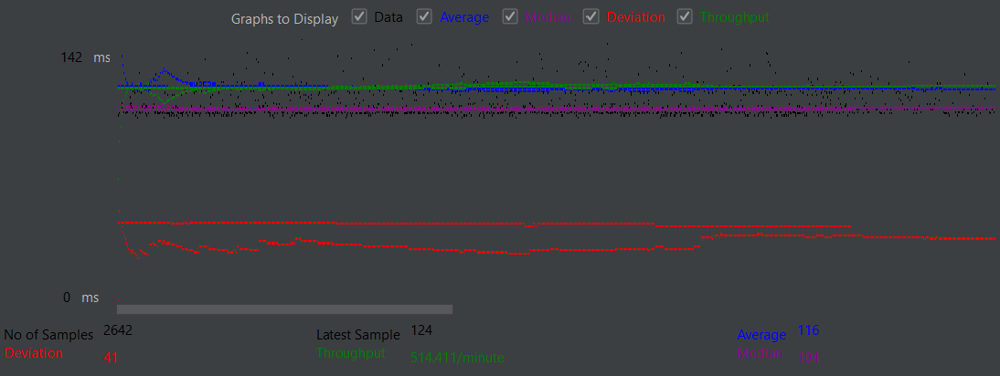
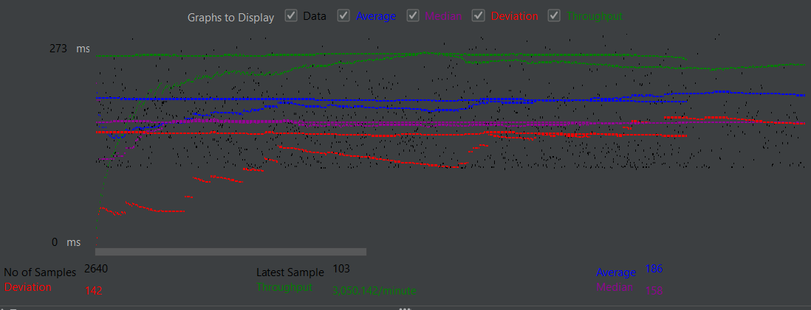
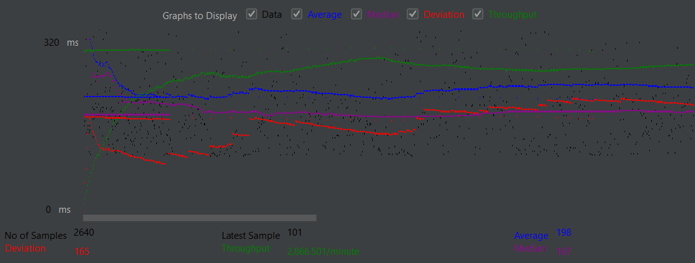

### Fablix
This is a full stack web app that was created for a project in databases and websites class. 
The website is based around users being able to interact with a large movie database in different ways.
The app has user authentication, search/browse functionality for movies (including information about directors, genres, stars, and release dates), as well as
a cart and checkout system allowing users to make (fake) purchases. Additionally, there is a built in employee dashboard for database management and updates.

# Websites
Main Login
- Website: http://50.16.192.214:8080/cs122b-project1-gg/login.html

Employee Login 
- Website: http://50.16.192.214:8080/cs122b-project1-gg/employee-login.html

# Android App
https://github.com/GabeGibb/fablix-android/tree/main

- # General
    - #### Team: gibbler:

    - #### Names: Gabriel Gibb:

    - #### Project 5 Video Demo Link:
      - https://docs.google.com/document/d/1OfX4tQXmQ9FUeEnkjxrEZUd2VQ5TmRdv9yqHkH134rY/edit?usp=sharing

    - #### Instruction of deployment:
      - Setup ubuntu instance
      - Install Java on instance
      - Install MySQL on instance, start it, and create a test user that has all privileges 
      - Install Tomcat on instane
      - Clone github repo 
      - Populate sql data based on the movie-data.sql file in repo
      - Add the stored procedure from the stored-procedure.sql file
      - Run UpdateSecurePassword.java on moviedb from this repo https://github.com/UCI-Chenli-teaching/cs122b-project3-encryption-example
      - Add employee credentials user "classta@email.edu" and password "classta"
      - Run mvn package in github repo folder
      - Copy the war file to the tomcat10 webapps folder

    - #### Collaborations and Work Distribution:
      - Solo Project, all work done by Gabriel Gibb
    

- # Connection Pooling
    - #### Include the filename/path of all code/configuration files in GitHub of using JDBC Connection Pooling
    - CONFIG (IN WEB CONTENT)
      - context.xml
      - web.xml
    - CODE (IN SRC) (Used JDBC and prepared statements)
      - AddMovieServlet.java
      - AddStarServlet.java
      - EmployeeLoginServlet.java
      - LoginServlet.java
      - MainPageServlet.java
      - MoviesServlet.java
      - PayServlet.java
      - SingleMovieServlet.java
      - SingleStarServlet.java
    - #### Explain how Connection Pooling is utilized in the Fabflix code.
      - When connection to SQL a connection is created based on the configuration in context.xml. 
      This configuration defines a connection pool with 100 connections possible, max of 30 idle connections, and a 10000 
      millisecond timeout is set as a maximum timeout.
      - The web.xml file registers database resources as described in context.xml
      - In every servlet that interacts with SQL, a connection is made through a datasource object, a query can be made using a 
      prepared statement, and once the servlet is done the connection can go back to the pool.
      - Also added cache prepared statements in the context.xml url
    - #### Explain how Connection Pooling works with two backend SQL.
    - When connections are pooled, any user might connect to any instance that exists in the pool.
    - For read operations, slave instances can get their own local sql data and send it to the servlets to read.
    - Any write operations are sent to master instances, changing the database of the master instance and then replicating that change
    to all slaves.
    - Connections can stay open and can be borrowed for a short time for use before being sent back to the pool.
    

- # Master/Slave
    - #### Include the filename/path of all code/configuration files in GitHub of routing queries to Master/Slave SQL.
      - There are no config files for routing Master/Slave in github. All changes needed to route Master/Slave were done via
      the master slave instances.
    - #### How read/write requests were routed to Master/Slave SQL?
      - In the mysqld.cnf files of both instances the bind addresses were set to 0.0.0.0. The master instance created a slave user
      that would allow another instance to replicate any sql changes made by the master. The slave instance was then made aware of the 
      master instance and started a slave program. These changes allow the master instance to propagate sql changes to the slave and 
      not vise versa. All read requests do not have to be routed, as they can just be read from the slave or master with 0 propagation.
      However, write requests (if originating from a slave instance) are then sent to the master instance for changes to be propagated
      later to any slaves. If a write request is originates in a master instance, the change is made and sent to slave instances.

- # JMeter TS/TJ Time Logs
    - #### Instructions of how to use the `log_processing.*` script to process the JMeter logs.
        - For jmeter logs, make sure to go into the first line of code in log_processing and change the file name to the corresponding
      text file for any given test. Then, run the python file. The python file will output the average ts and tj time in milliseconds.
        - NOTE, the log files exist within the target folder however I moved them to their own folder and changed log processing accordingly just to be visible in github.
- # JMeter TS/TJ Time Measurement Report
- Some Notes
  - The average servlet time should be only consistently slightly higher than the JDBC time in all cases, since the bulk of each query
    is connecting to sql and network travel time seemed to be very short. I was not really able to separate all logic from just the queries so most of the time spent is querying and 
    performing logic based on those queries (meaning that the JDBC time will look relatively high). Single instances should not struggle
    with single threads. Single instances should struggle with multiple threads and the scaled version helps alleviate this problem. In
    any case, non-connection pooled instances should also be slow.
  - Also, all cases have been done without the XML parser as I never got it to work

| **Single-instance Version Test Plan**          | **Graph Results Screenshot** | **Average Query Time(ms)** | **Average Search Servlet Time(ms)** | **Average JDBC Time(ms)** | **Analysis (explain)**                                                                                                                                                                                |
|------------------------------------------------|------------------------------|----------------------------|-------------------------------------|---------------------------|-------------------------------------------------------------------------------------------------------------------------------------------------------------------------------------------------------|
| Case 1: HTTP/1 thread                          |               | 116                        | 60                                  | 57                        | When having single threads, the servlet is able to process a request and prepare for the next one after it's done. This allows for a fast ability to process requests.                                |
| Case 2: HTTP/10 threads                        |               | 336                        | 264                                 | 261                       | When having multiple threads, our server needs to be able to server requests while taking in incoming requests, leading to a slowdown since our server is trying to do too many things at once.       |
| Case 3: HTTPS/10 threads                       |               | 340                        | 272                                 | 270                       | Same reasons as 10 threads http, however https has additional overhead/security that can slow down our queries slightly.                                                                              |
| Case 4: HTTP/10 threads/No connection pooling  |               | 350                        | 282                                 | 279                       | This result was done with connection pooling, however a lack of connection pooling means servlets have to keep opening and closing connections which should lead to a slowdown greater than recorded. |

| **Scaled Version Test Plan**                   | **Graph Results Screenshot** | **Average Query Time(ms)** | **Average Search Servlet Time(ms)** | **Average JDBC Time(ms)** | **Analysis**                                                                                                                                                                                                                                                                                                   |
|------------------------------------------------|------------------------------|----------------------------|-------------------------------------|---------------------------|----------------------------------------------------------------------------------------------------------------------------------------------------------------------------------------------------------------------------------------------------------------------------------------------------------------|
| Case 1: HTTP/1 thread                          |               | 116                        | 54                                  | 51                        | This result should be comparable to our single instance version, since 1 thread means our servlet serves a connection and once done, processes the next request without having to process multiple things at once.                                                                                             |
| Case 2: HTTP/10 threads                        |               | 186                        | 132                                 | 129                       | Although multiple threads will slow us down, the scaled version now has twice the servers running, meaning each servlet could process 5 threads at once instead of 10 at once. This leads to a faster ability to serve multiple users.                                                                         |
| Case 3: HTTP/10 threads/No connection pooling  |               | 198                        | 146                                 | 144                       | This result was done with connection pooling, however this should be slower than any of the tests in the scaled version but faster than a non-connection pooled test for our single instance version. This is because we would have to continuously open and close connections instead of using existing ones. |

